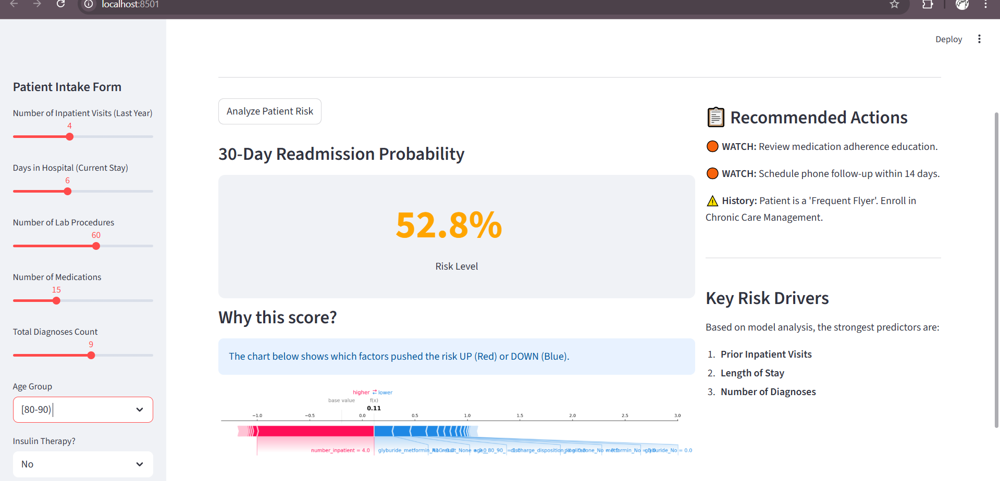
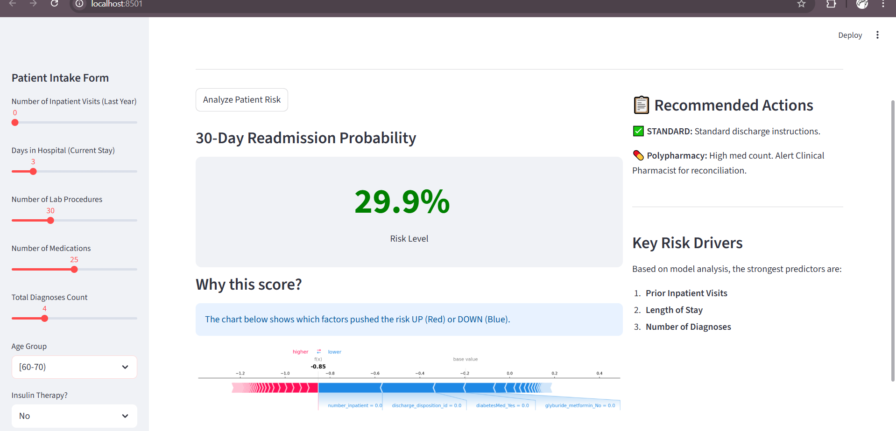
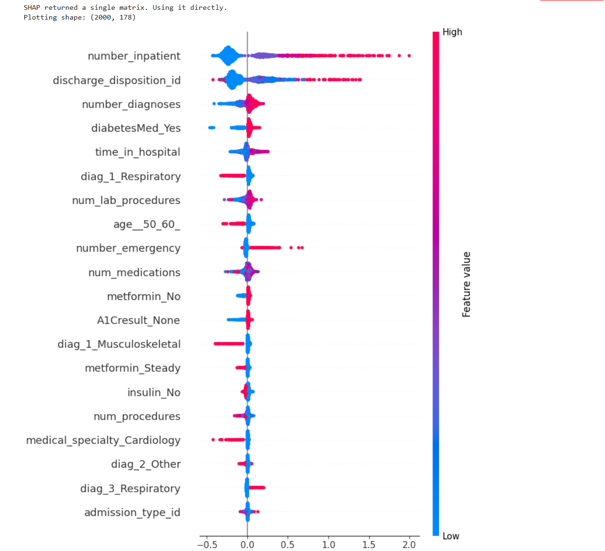
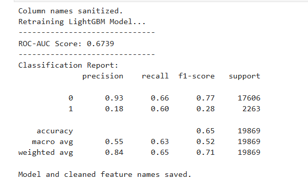

# 🏥 Hospital Readmission Risk AI

### PropTech Data Scientist | Adonis Chiruka


## 📋 Executive Summary
This project implements a **Clinical Decision Support System (CDSS)** to predict hospital readmissions for diabetic patients. In the US healthcare system, hospitals are penalized for patients readmitted within 30 days. This tool identifies "High Risk" patients at discharge and suggests specific intervention protocols (e.g., Social Worker consults, Medication Reconciliation).

**Business Value:**
* **Metric:** Recall (catching high-risk cases) optimized to **60%** (vs baseline 11%).
* **Explainability:** Uses SHAP values to explain *why* a patient is at risk, moving beyond "black box" predictions.
* **Actionability:** Integrated rule-based logic suggests clinical interventions based on specific risk drivers.

## 🖼️ Dashboard Demo

### 🔴 Scenario 1: High Risk (The "Frequent Flyer")
*Patient with 4 prior inpatient visits triggers "Urgent" protocols.*


### 🟠 Scenario 2: Hidden Risk (Polypharmacy)
*Patient with low history but high medication count triggers a pharmacist review.*


---

## 🛠️ Technical Architecture

### 1. Data Pipeline
* **Source:** UCI Diabetes 130-US Hospitals Dataset (100k+ records).
* **Preprocessing:** * Grouped 700+ ICD-9 codes into 9 clinical categories (Circulatory, Respiratory, etc.).
    * Handled "informative missingness" for HbA1c and Glucose tests.
    * Sanitized feature names for LightGBM compatibility.

### 2. Modeling Strategy
* **Algorithm:** LightGBM (Gradient Boosting) chosen for efficiency on tabular data.
* **Class Imbalance:** Handled using `scale_pos_weight` (7.8 ratio) to prioritize the minority "Readmitted" class.
* **Explainability:** SHAP (SHapley Additive exPlanations) TreeExplainer used to generate global and local importance plots.



### 3. Performance
* **ROC-AUC:** 0.67 (Competitive with published research benchmarks for this dataset).
* **Recall (Class 1):** 0.60 (Captures 60% of potential readmissions).



---

## 🚧 Limitations & Future Improvements
While functional, this project has known limitations characteristic of its academic nature:

1.  **Data Currency (ICD-9 vs ICD-10):**
    The model uses ICD-9 diagnosis codes (dataset range: 1999-2008). Modern healthcare systems utilize ICD-10. Deployment would require a mapping layer or retraining on modern EHR data.

2.  **Precision vs. Recall Trade-off:**
    The model prioritizes **Recall (60%)** to minimize missed readmissions. This results in a lower Precision (~18%), implying a higher false-positive rate. In a production setting, this would be tuned based on the hospital's specific resource capacity for follow-up interventions.

3.  **Scope:**
    The training data is specific to **diabetic encounters**. Generalizability to other conditions (e.g., heart failure, sepsis) has not been tested.
    
---

## 📂 Project Structure

```text
hospital-readmission-risk-ai/
├── app/
│   └── main.py              # Streamlit Dashboard application
├── assets/                  # Screenshots for documentation
├── data/
│   ├── raw/                 # Original UCI Dataset
│   └── processed/           # Cleaned CSVs (GitIgnored)
├── models/
│   ├── lgbm_readmission_v1.pkl  # Trained Model
│   └── feature_names.pkl        # Serialized feature list
├── notebooks/
│   └── 01_Data_Ingestion.ipynb  # Download & Extraction & the rest of the process
│    
│   
├── documentation.md         # User Guide & Features
├── methodology.md           # Deep dive into Math/Code
├── requirements.txt         # Dependencies
└── README.md                # This file
```
---

## 🚀 How to Run Locally

1. **Clone the Repo**
   ```bash
   git clone [https://github.com/stilhere4huniid/hospital-readmission-risk-ai.git](https://github.com/stilhere4huniid/hospital-readmission-risk-ai.git)
   cd hospital-readmission-risk-ai
   ```

2. **Install Dependencies**
   ```bash
   pip install -r requirements.txt   
   ```

3. **Run the Dashboard**
   ```bash
   streamlit run app/main.py

---


## ⚠️ Disclaimer
This tool is a Proof of Concept (PoC) designed for educational and portfolio purposes. It is not a certified medical device and should not be used for actual patient diagnosis or treatment without clinical validation.

## 📜 License
This project is licensed under the MIT License - see the [LICENSE](LICENSE) file for details.

